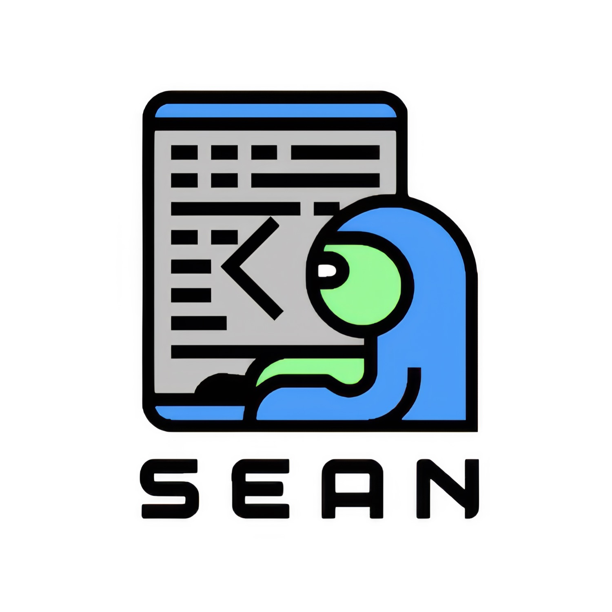

<div align="center">



# Email-Web · 邮件营销工作台

**联系人管理、合规群发、AI 介绍信与名片宝客户导入的一体化 Web 应用**

[](https://nextjs.org/)
[](https://react.dev/)
[](https://www.prisma.io/)
[](https://www.docker.com/)
[](LICENSE)

</div>

Email-Web 是一个面向销售与外贸团队的邮件营销工作台。它把联系人、分组、模板、SMTP 发件账号、群发任务、发送记录、黑名单和垃圾词检测集中到一个多用户隔离的 Web 应用中，并支持从名片宝导入客户资料、用 AI 生成介绍信后保存为邮件模板。

## 🌐 在线演示

Demo 站点：[https://email.pocketbay.app/](https://email.pocketbay.app/)

> 合规提示：请仅向拥有合法联系基础并已取得相应授权的收件人发送邮件，遵守适用的反垃圾邮件、隐私与数据保护法规。

## ✨ 核心能力

- **多用户隔离**：基于 JWT 与 httpOnly Cookie 的登录态；联系人、模板、账号、任务与日志按用户分隔。
- **联系人与分组**：支持 CSV / Excel 导入、标签、变量字段、分组管理和批量操作。
- **邮件模板与任务**：HTML / 纯文本模板、占位变量、计划任务、暂停 / 停止和发送记录。
- **SMTP 账号轮发**：支持多账号、连接测试、轮询 / 权重策略、速率与配额控制。
- **合规辅助**：黑名单、敏感词检测、退订链接和发送审计。
- **AI 介绍信**：使用 OpenAI 兼容接口生成 HTML 介绍信，可一键保存成模板。
- **名片宝导入**：从兼容的名片宝实例导入已调研的客户资料，写入当前用户联系人库。
- **本地与平台部署**：本地 Docker Compose 使用 SQLite；托管环境可使用 PostgreSQL。

## 🚀 快速开始

### Docker Compose（推荐）

```bash
git clone https://github.com/sean198604/email-web.git
cd email-web
cp .env.example .env
# 编辑 .env：至少设置 JWT_SECRET、ADMIN_EMAIL 和 ADMIN_PASSWORD
docker compose up -d --build
```

访问 `http://localhost:5051`。首次以 `.env` 中的管理员邮箱和密码注册时，会自动创建管理员账户。

检查服务：

```bash
docker compose ps
curl http://localhost:5051/login
```

### 本地开发

```bash
npm ci
cp .env.example .env
npx prisma migrate deploy
npm run dev
```

默认访问地址：`http://localhost:5051`。

## ⚙️ 必要配置

| 变量 | 是否必需 | 说明 |
| --- | --- | --- |
| `JWT_SECRET` | 必需 | 至少 32 个字符的随机签名密钥，例如 `openssl rand -base64 48` |
| `ADMIN_EMAIL` | 首次管理需要 | 首次注册时用于识别管理员账户 |
| `ADMIN_PASSWORD` | 首次管理需要 | 管理员注册密码 |
| `COOKIE_SECURE` | 按环境 | HTTP 本地部署设为 `false`；HTTPS 公网部署设为 `true` |
| `DEEPSEEK_API_KEY` | AI 功能可选 | AI 介绍信使用的 OpenAI 兼容 API Key |
| `CARD_RESEARCH_BASE_URL` | 名片导入可选 | 名片宝服务地址 |

真实凭据、数据库和邮件内容不得提交：`.env`、`*.db`、`config.json`、用户上传文件均应保留在本地或受控的生产存储中。

## 🔗 与名片宝联动

Email-Web 可把名片宝中已完成客户调研的结果直接转为可营销、可追踪的联系人资料，避免重复录入：

1. 在 **名片宝** 完成客户名片识别、企业信息补全或客户调研。
2. 在 Email-Web 的 **联系人** 页面选择“从名片宝导入”，连接已配置的名片宝服务并选择需要导入的客户。
3. 客户姓名、公司、邮箱、电话、国家/地区、职位、网站、标签及调研摘要等资料会写入当前登录用户的联系人空间；导入后可继续编辑、分组和去重。
4. 在 **AI 介绍信** 中选取导入的联系人或联系人列表，基于客户背景生成个性化 HTML 介绍信，并保存为邮件模板。
5. 在 **群发任务** 中使用模板和联系人分组，通过已测试的 SMTP 账号发送，并在发送日志中持续跟踪结果。

名片宝服务地址通过 `CARD_RESEARCH_BASE_URL` 配置；Docker 环境中，如服务运行在宿主机，可使用 `http://host.docker.internal:7004`。请只连接受信任的名片宝实例。

## 🧭 使用流程

1. 在 **联系人** 中创建分组，或从 CSV / Excel 导入客户；如已在名片宝完成调研，可直接导入客户资料。
2. 在 **SMTP 账号** 中添加并测试受控发件账号。
3. 创建邮件模板；需要个性化文案时可用 **AI 介绍信** 生成后保存。
4. 配置发送速率、账号轮发策略、黑名单与退订链接。
5. 创建群发任务并在 **发送日志** 中跟踪结果。

## 🧱 技术栈

| 层 | 技术 |
| --- | --- |
| Web 框架 | Next.js 16、React 19、TypeScript |
| 界面 | Tailwind CSS、shadcn/ui、Framer Motion |
| 数据访问 | Prisma 7；本地 SQLite / 托管 PostgreSQL |
| 认证 | jose（JWT）、bcryptjs、httpOnly Cookie |
| 邮件 | Nodemailer |
| 数据处理 | CSV / Excel 导入导出、TanStack Table、Recharts |
| 部署 | Docker 多阶段构建、Docker Compose |

## 📁 目录结构

```text
├── src/app/                 # 页面与 API 路由
│   ├── contacts/            # 联系人与名片宝导入
│   ├── ai-intro/            # AI 介绍信生成器
│   ├── templates/ tasks/    # 模板与群发任务
│   └── api/                 # 鉴权、联系人、邮件、设置等接口
├── src/lib/                 # Prisma、认证、发送与合规逻辑
├── prisma/                  # PostgreSQL 与 SQLite Schema
├── scripts/start.mjs        # 启动时数据库同步策略
├── Dockerfile
├── docker-compose.yml
└── .env.example             # 不含真实值的配置模板
```

## 🔒 安全与数据边界

- 应用启动要求设置强 `JWT_SECRET`，不会使用公开或可预测的默认密钥。
- SMTP 密码、AI Key 和管理员密码只应通过受控环境变量或用户私有设置保存。
- 名片宝导入只应连接到你信任的服务；导入数据写入当前登录用户的空间。
- 发送邮件前请验证收件人来源、退订机制和当地法律要求。

## License

[MIT](LICENSE)
